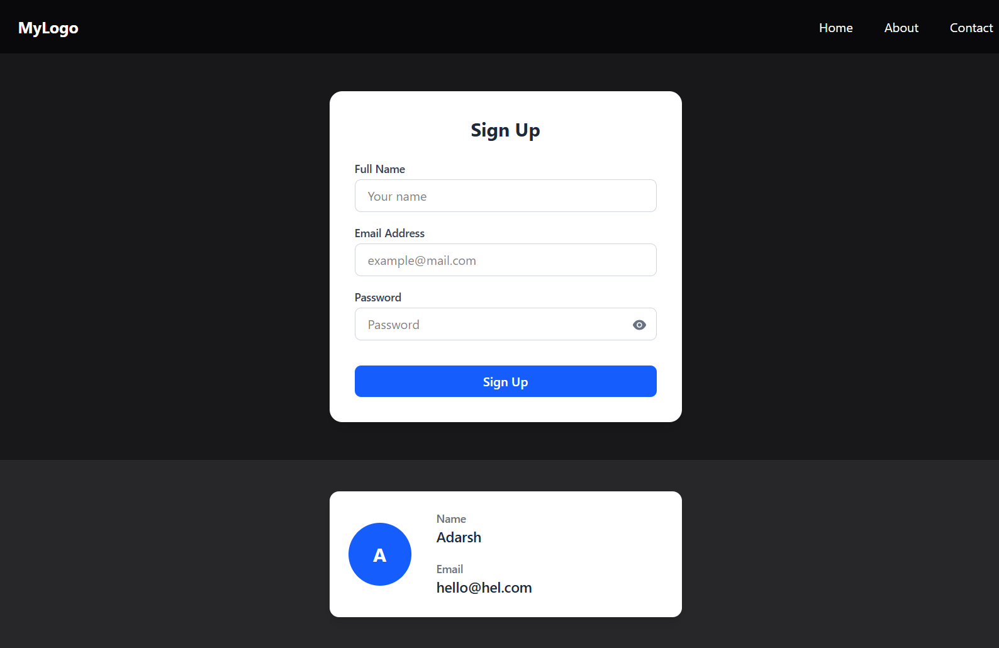

# Internship Assignment - SimplerTechnologies

This project is a **React.js assignment** completed as part of the internship process at **SimplerTechnologies**. It includes a responsive **Navbar**, a validated **Sign-Up Page**, and a **User Card** component.

---

## 🚀 Features
- **Navbar**
  - Responsive navigation bar with desktop and mobile menu.
  - Mobile hamburger menu with smooth open/close animation.
  - Hover underline effect for menu items.
- **Sign-Up Page**
  - User-friendly sign-up form with validation:
    - Full Name required.
    - Email format validation.
    - Password minimum 6 characters.
  - Password show/hide toggle.
  - Error messages shown inline.
  - Success alert on valid submission.
- **User Card**
  - Landscape card layout with profile icon (first letter of user’s name).
  - Displays Name and Email fields with labels.
  - Fully responsive design.
  - Smooth hover shadow effect.

---

## 📂 Project Structure
```
├── public
├── src
│ ├── assets
│ ├── components
│ │ ├── Navbar.jsx
│ │ ├── SignUpPage.jsx
│ │ └── UserCard.jsx
│ ├── App.jsx
│ ├── index.css
│ └── main.jsx
├── .gitignore
├── eslint.config.js
├── html.html
├── package-lock.json
├── package.json
├── README.md
└── vite.config.js
```

---

## 🛠️ Tech Stack

- **Frontend:** React  
- **Styling:** TailwindCSS  
- **Build Tool:** Vite  
- **UI Libraries:** React Icons  

---

## 📸 Screenshots

